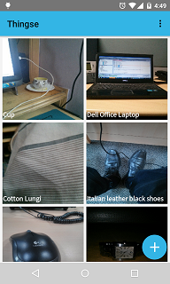
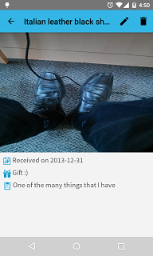
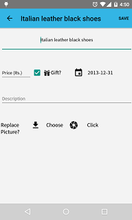

Thingse
=======

Thingse is an Android app to keep track of stuff you have. 

For details, please visit http://blog.pleb.in/ 

Posts on changes to material design and other UI components
- http://blog.pleb.in/2015/07/moving-to-material-design-adding-fab.html
- http://blog.pleb.in/2015/07/moving-to-material-design-changing_26.html
- http://blog.pleb.in/2015/08/not-really-material-design-change-image.html
- http://blog.pleb.in/2015/08/grid-view-font-changes-and-new-icon.html
- http://blog.pleb.in/2016/03/smooth-user-experience-through-asynctask.html
- http://blog.pleb.in/2016/03/implementing-pull-to-refresh.html
